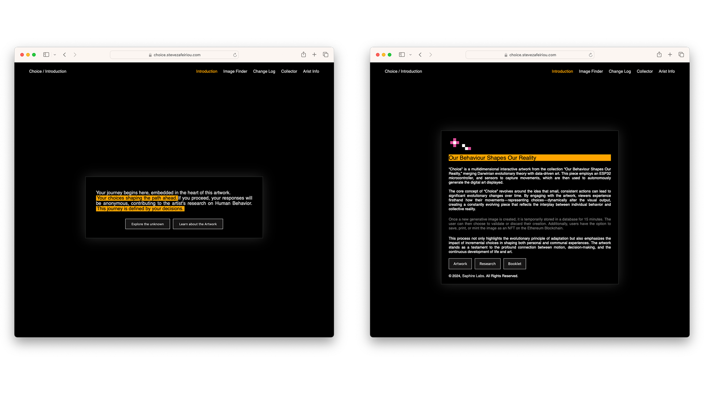
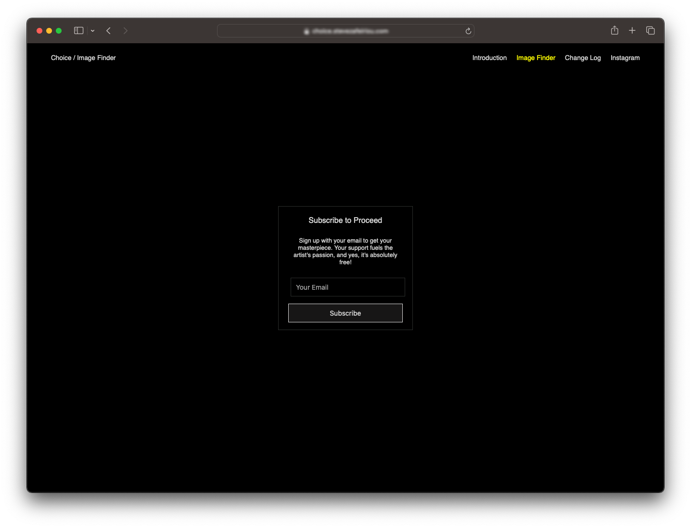
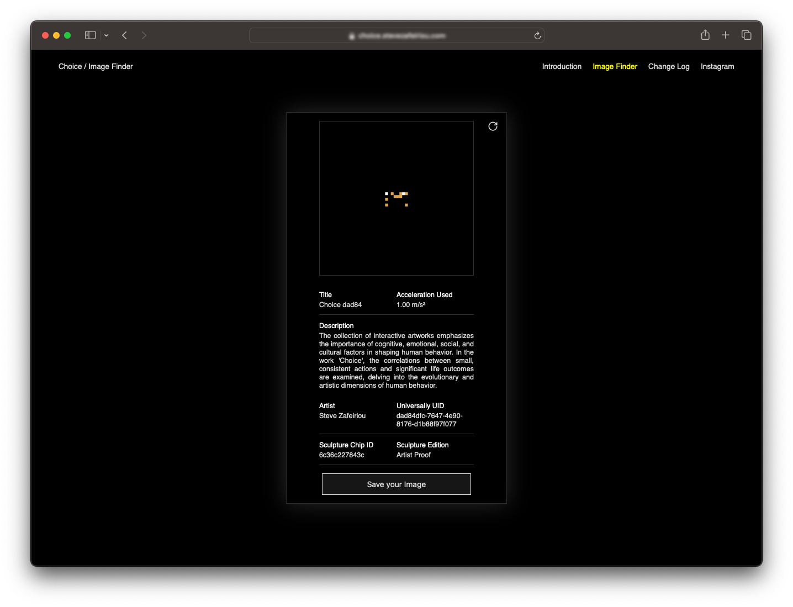
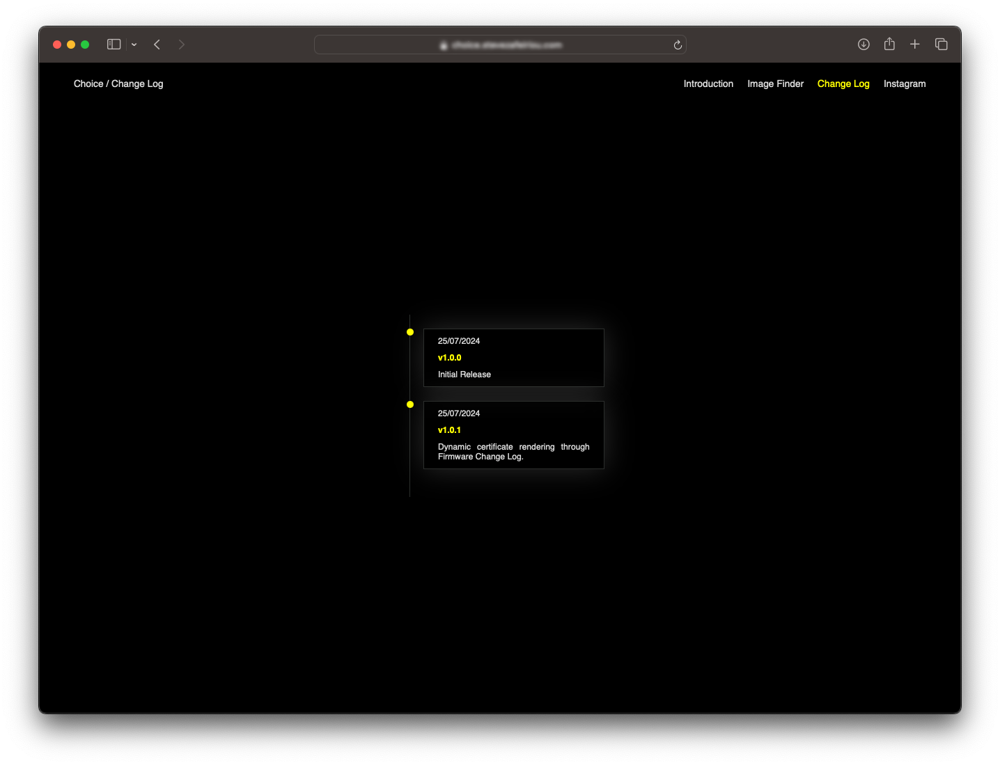
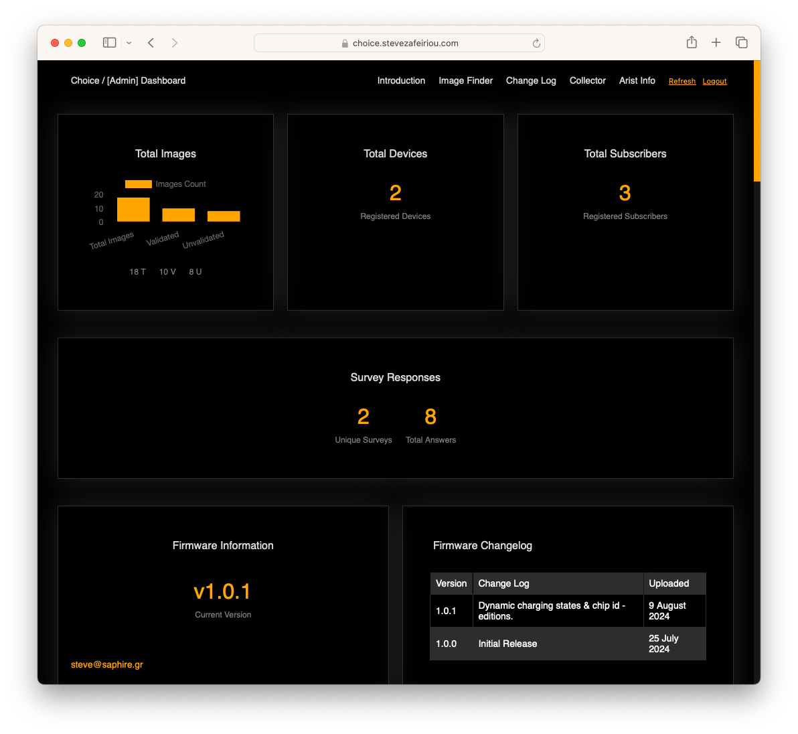
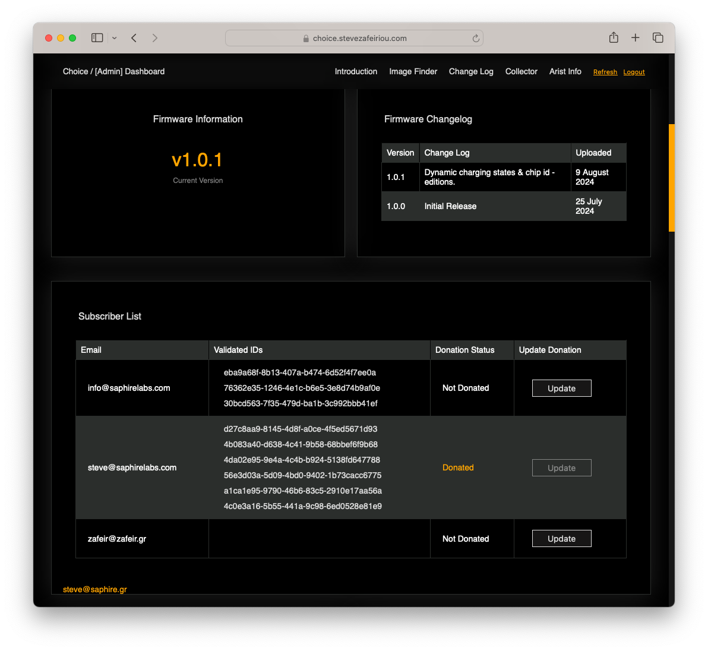
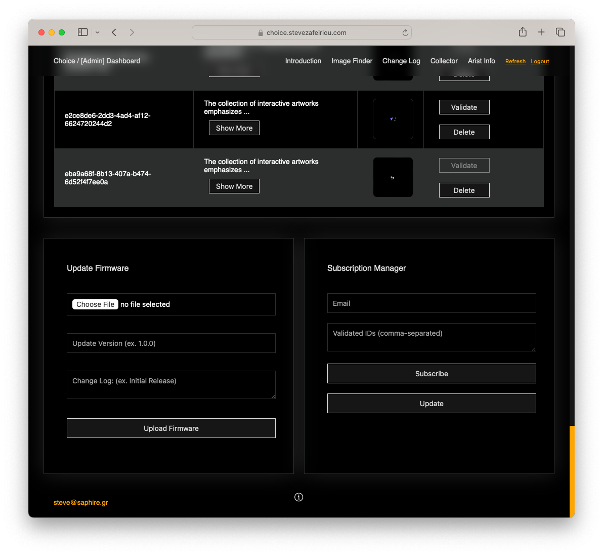
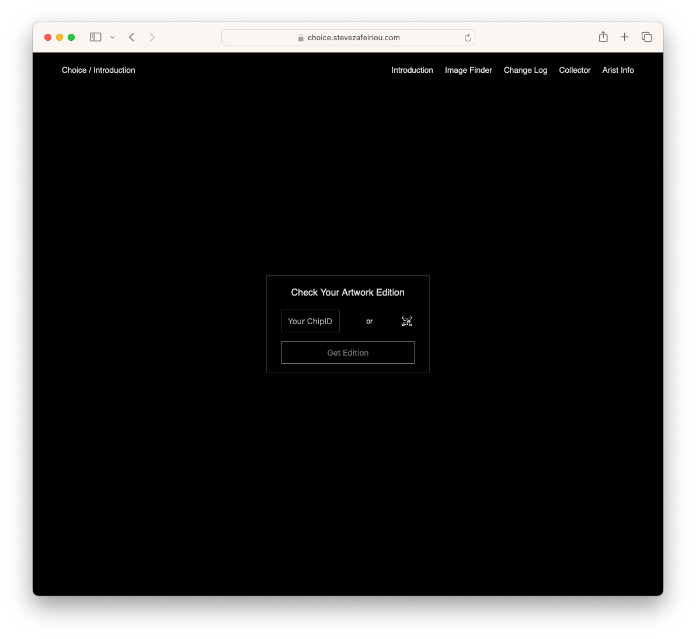
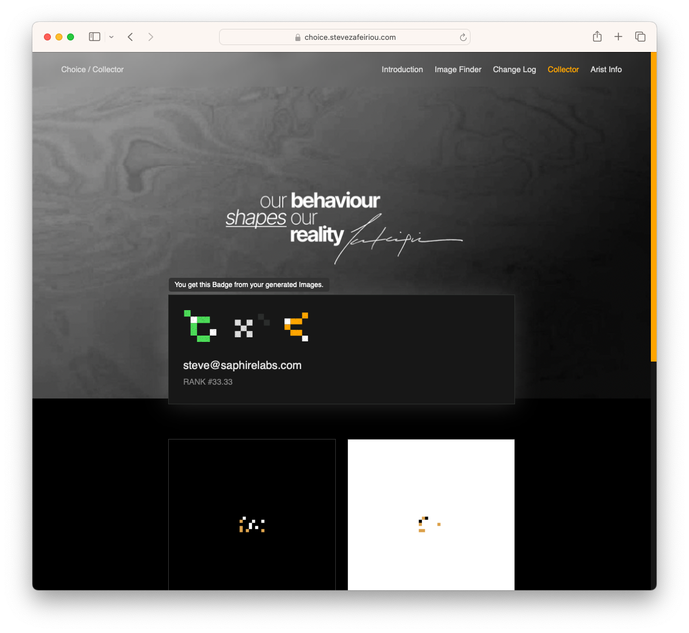

# Choice Extention (Installation): Image Finder (React.js App)



## Table of Contents

- [Introduction](#introduction)
- [Installation](#installation)
- [Usage](#usage)
- [Components](#components)
  - [ImagePage](#imagepage)
  - [SubscriptionForm](#subscriptionform)
  - [ImageCard](#imagecard)
  - [FindGenerationsById](#findgenerationsbyid)
  - [ChangeLog](#changelog)
  - [Dashboard](#dashboard)
  - [Styled Components](#styled-components)
  - [Game](#game)
  - [Editions](#editions)
  - [Collector](#collector)
- [Configuration](#configuration)
- [Global Styles](#global-styles)
- [Licensing](#licensing)

## Introduction

This React application allows users to view and interact with generative images created by the "Choice" interactive sculpture. Users can save and print images after subscribing. In the future, this functionality can be enhanced to enable minting (on-chain) the generative images as NFTs on the Ethereum blockchain using web3 wallets. The app fetches image data from a backend endpoint and provides a seamless user experience with various functionalities such as subscription, validation, image operations, interactive storytelling through a survey-based game, and a profile page for collectors.

## Installation

To get started with the project, clone the repository and install the necessary dependencies:

```bash
git clone https://github.com/saphirelabs/choice-img-finder.git
cd choice-img-finder
npm install
```

### Create `.env` file

Create a `.env` file in the root directory of your project and add the following environment variables:

```
REACT_APP_API_BASE_URL=
REACT_APP_AUTH_API_BASE_URL=
REACT_APP_LOGO_URL=
```

These environment variables define the base URLs for the backend API. Ensure these are correctly set to avoid exposing sensitive data.

## Usage

To run the app in development mode, use:

```bash
npm start
```

Open `http://localhost:3000` to view it in the browser. Please note that the endpoints in this project have Access-Control-Allow-Origin restrictions, which may prevent you from using them. For more information, please contact us.

## Components

### ImagePage

`ImagePage` is the main component of the application, handling the display of images, user subscription, and image operations like save and print.

**Key Features:**

- Fetches image data based on URL parameters.
- Manages user subscription status and handles validation.
- Provides save and print functionalities for subscribed users.

### SubscriptionForm



`SubscriptionForm` is used to collect the user's email for subscription purposes.

**Key Features:**

- Displays a form for email subscription.
- Calls a function to handle the subscription process on form submission.

### ImageCard



`ImageCard` displays the image data and provides options to save or print the image.

**Key Features:**

- Shows image details such as title, description, artist, and unique identifiers.
- Provides buttons for saving and printing the image, with conditions based on subscription status.
- Includes a reset button to clear local storage and refresh the page.

### FindGenerationsById


`FindGenerationsById` allows users to search for images by UUID or select from recent unvalidated images.

**Key Features:**

- Provides a text input for searching images by UUID.
- Fetches and displays a list of recent unvalidated images for selection.
- Submits the selected or entered UUID to fetch the corresponding image data.

### ChangeLog



`ChangeLog` displays the firmware changelog for the "Choice" interactive sculpture.

**Key Features:**

- Fetches and displays the firmware changelog from the backend API.
- Sorts the changelog entries by date in descending order.
- Shows version numbers and descriptions of changes.

### Dashboard

`Dashboard` provides an overview and management tools for various aspects of the "Choice" interactive sculpture system.

**Key Features:**

- **Overview Cards:** Provides a quick glance at the total number of images, devices, and subscribers.



- **Firmware Information:** Displays the current firmware version and its changelog. Includes tools to upload a new firmware version and its changelog.



- **Subscriber Management:** Lists all subscribers and provides tools to manage subscriptions.
- **Device Management:** View and manage registered devices. Includes tools to register new devices or update existing ones.



- **Image Data Management:** Provides a detailed list of images that can be validated or deleted as needed.

### Styled Components

The application uses `styled-components` for styling. Key styled components include:

- **ImagePageContainer:** Container for the main image page with a gradient background and custom scrollbars.
- **ImageCardContainer:** Container for individual image cards with styling for display and layout.
- **SubscriptionFormContainer, Form:** Containers and styling for the subscription form elements.
- **Image, ImageCardP, ButtonWrap, FooterP, ResetButton, TextWrapper:** Various styled components for images, text, buttons, and layout.
- **TimelineContainer, Timeline, TimelineItem, Dot, TimelineContent, TimelineDate, TimelineVersion, TimelineLog:** Components for displaying the changelog.

### Game

`Game` is an interactive storytelling component where users make decisions that shape their journey and the resulting content.

**Key Features:**

- **Dynamic Survey:** Users navigate through a series of questions, each influencing the next.
- **UUID Generation:** Generates a unique identifier for each survey session to track user interactions.
- **Survey Submission:** Collected answers are submitted to the backend once the survey is completed.
- **Interactive Content:** Displays content based on the user's choices after the survey ends.

### Editions



`Editions` allows users to validate and manage their artwork certificates, including using QR code scanning.

**Key Features:**

- **Chip ID Validation:** Users can input or scan their Chip ID to check their artwork edition.
- **QR Code Scanning:** Integrates QR code scanning for Chip ID input.
- **Certificate Access:** Provides links to download or view the Certificate of Authenticity (COA) based on the Chip ID.
- **Social Sharing:** Users can tweet about their ownership of the artwork directly from the app.

### Collector



`Collector` provides a detailed profile page for users, displaying their collected images, profile information, and badges earned.

**Key Features:**

- **Image Collection Display:** Shows all the images collected by the user based on their email.
- **Profile Information:** Displays user's email, total images collected, rank, and a profile image generated from their collection.
- **Interactive Badges:** Users earn badges based on their collection and contributions, such as owning a sculpture or donating.
- **Image Modal:** Allows users to view detailed information about each image in their collection through a modal popup.
- **Dynamic Profile:** The profile image and dominant color badge are dynamically generated based on the user's collected images.

## Configuration

The `dbEndpoint` for the backend API is defined in the `.env` file:

```
REACT_APP_API_BASE_URL=
REACT_APP_AUTH_API_BASE_URL=
REACT_APP_LOGO_URL=
```

Ensure these environment variables are set correctly to point to your backend API.

## Global Styles

Global styles are defined using `createGlobalStyle` from `styled-components`:

```javascript
import { createGlobalStyle } from "styled-components";

export const GlobalStyle = createGlobalStyle`
    * {
        margin: 0;
        padding: 0;
        box-sizing: border-box;
    }

    html, body {
        font-size: 1rem;
        font-family: 'Inter', sans-serif;
    }
`;
```

These global styles ensure a consistent baseline for styling across the application.

---

This documentation provides a comprehensive overview of the Choice Extention: Web Application, detailing its setup, functionality, and usage. Follow the provided instructions to run, deploy, and update the code as needed. For any inquiries, please contact Steve Zafeiriou at: steve@saphirelabs.com.
